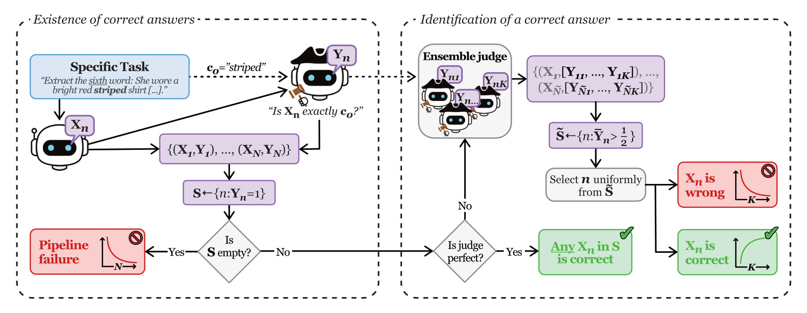
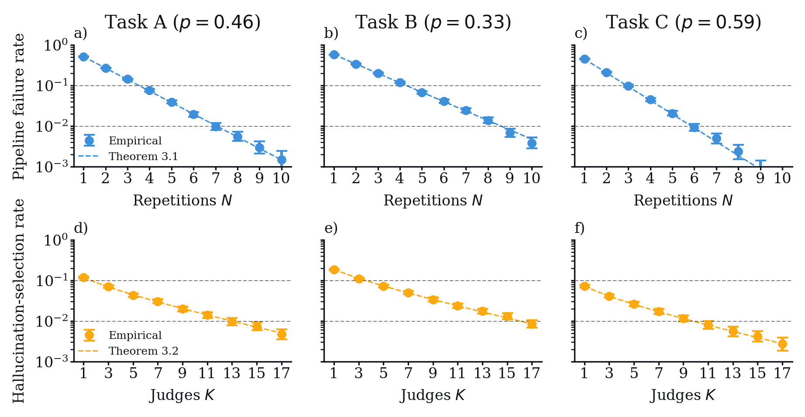

# Probabilistic Guarantees for Reducing Contextual Hallucinations in LLMs

 

This code demonstrates a pipeline that gives probabilistic guarantees for the occurence and selection-probability of contextually correct vs. hallucinated answers in LLM responses. A full description of the pipeline is given in the manuscript *"Probabilistic Guarantees for Reducing Contextual Hallucinations in LLMs"* by Rautenberg & Schippkus (2026).

The resulting statistics are

<figure>
   
  <figcaption>Empirical performance of the repetition-judge pipeline and ensemble judge, estimated over 10,000 pipeline runs. The code here produces this figure.</figcaption>
</figure>

## Abstract

Large language models (LLMs) frequently produce contextual hallucinations, where generated content contradicts or ignores information explicitly stated in the prompt. Such errors are particularly problematic in deterministic automation workflows, where inputs are fixed and correctness is unambiguous. We introduce a simple and model‑agnostic framework that provides explicit probabilistic guarantees for reducing hallucinations in this setting.  

We formalize the notion of a specific task, defined by a fixed input and a deterministic correctness criterion, and show that issuing the same prompt in independent context windows yields an exponential reduction in the probability that all model outputs are incorrect. To identify a correct answer among repeated runs, we incorporate an LLM-as-a-judge and prove that the probability that the judged pipeline fails decays at a rate determined by the judge's true- and false-positive probabilities. When the judge is imperfect, we strengthen it through majority vote over independent judge calls, obtaining ensemble-level error rates that decrease exponentially in the number of votes. This yields an explicit bound on the probability that the pipeline selects a hallucinated answer.

Experiments on controlled extraction tasks with synthetic noisy judges match these predictions exactly: pipeline failure decreases exponentially with the number of repetitions, and hallucination-selection decreases exponentially with the number of judges in the ensemble. Together, these results provide a lightweight, modular, and theoretically grounded method for driving hallucination probabilities arbitrarily low in fixed-input LLM workflows-without modifying model weights, decoding strategies, or prompt engineering.
